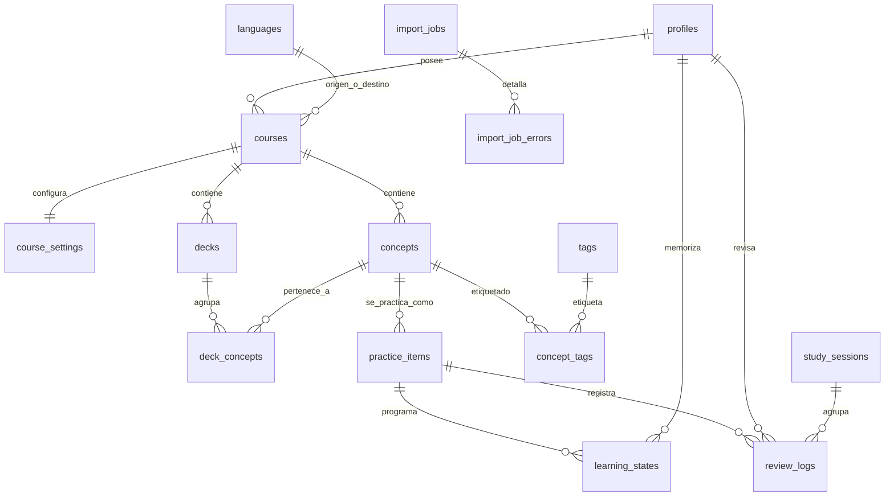

# Modelo de datos

Entidades de Lexora, cómo se relacionan y qué convenciones sigue el esquema.
Las decisiones que lo condicionan están en
[ADR-002](adrs/ADR-002-supabase-sin-orm.md) y
[ADR-003](adrs/ADR-003-fsrs-programa-practice-item.md).

> **Estado:** existen las cuatro tablas de identidad y curso (`profiles`,
> `languages`, `courses`, `course_settings`), con sus políticas RLS
> (migraciones `20260828143434_identity_and_course` y
> `20260831162304_identity_and_course_rls`). El resto del modelo descrito aquí
> es lo acordado; las columnas exactas, restricciones, índices y políticas se
> fijan en las migraciones SQL de cada fase, que son la fuente de verdad del
> esquema.

## La distinción que lo explica todo

```text
Concept          «achievement» — la unidad de conocimiento
   │
   ├── PracticeItem A   achievement → logro          (reconocimiento)
   ├── PracticeItem B   logro → achievement          (recuperación)
   ├── PracticeItem C   audio → achievement          (dictado, futuro)
   └── PracticeItem D   escribe una frase con…       (producción, futuro)
                              │
                              └── LearningState      un estado por usuario e ítem
```

Un concepto agrupa; **no** acumula progreso. El estado de memoria pertenece a la
pareja *(usuario, `PracticeItem`)*, porque reconocer una palabra y ser capaz de
producirla son capacidades distintas que se olvidan a ritmos distintos.

Una variación superficial del enunciado no crea un calendario nuevo: dos frases
con hueco que miden la misma recuperación son variantes de presentación del mismo
`PracticeItem`.

## Diagrama



## Entidades

### Identidad y configuración

| Tabla | Papel |
|---|---|
| `profiles` | Extensión uno a uno de la tabla de usuarios de autenticación: nombre, idioma de interfaz, zona horaria, fin del onboarding. |
| `languages` | Catálogo de referencia. Permite representar un idioma y su variante regional sin mezclarlos con el idioma de la interfaz. |
| `courses` | Relaciona un idioma de origen con uno de destino y configura la experiencia de estudio. |
| `course_settings` | Preferencias por curso: límite diario de elementos nuevos, límite de repasos, versión de configuración del planificador. |

Cuatro conceptos de idioma se mantienen separados a propósito: idioma de la
interfaz, idioma de apoyo, idioma estudiado y variante regional del contenido.
Mezclarlos es la vía rápida a un modelo que no admite un segundo par de idiomas.

#### Esquema exacto (migración `20260828143434_identity_and_course`, LEX-2.1)

Estados cerrados como enums de PostgreSQL: `ui_locale` (`es`, `en`) y
`cefr_level` (`A1`, `A2`, `B1`, `B2`).

**`profiles`** — extensión uno a uno de `auth.users`.

| Columna | Tipo | Notas |
|---|---|---|
| `id` | `uuid` PK | `= auth.users(id)`, `on delete cascade` |
| `display_name` | `text` NULL | CHECK: nulo, o 1–80 caracteres tras recortar |
| `ui_locale` | `ui_locale` NOT NULL | por defecto `es` |
| `timezone` | `text` NOT NULL | por defecto `Europe/Madrid`; un trigger `BEFORE` exige que sea un nombre real de `pg_timezone_names` |
| `onboarding_completed_at` | `timestamptz` NULL | lo fija el onboarding (LEX-2.7/2.8) |
| `active_course_id` | `uuid` NULL | curso que la interfaz prioriza (LEX-2.9). NULL = usar el más antiguo. |
| `created_at`, `updated_at` | `timestamptz` NOT NULL | `updated_at` lo mantiene un trigger |

_Curso activo (migración `20260831215553_active_course`, LEX-2.9):_
`active_course_id` lleva una **FK compuesta** `(active_course_id, id) →
courses (id, owner_id)` con `on delete set null (active_course_id)`. La
columna `id` en la FK ata el curso activo al propio usuario igual que
`course_settings(course_id, user_id)` ata la configuración al dueño: un
`update` que apunte al curso de otro falla con `23503`, no «devuelve vacío al
leer». **La lista de columnas en `set null` es obligatoria**: sin ella,
`on delete set null` pondría a NULL también `id` —la PK— y el borrado del
curso fallaría (sintaxis de PostgreSQL 15+). Lo fija el onboarding
(`complete_onboarding`, vía `coalesce`) y, más adelante, un selector. Las
políticas RLS de `profiles` (LEX-2.3) ya cubren la columna; no hay política
nueva. Aislamiento probado en `supabase/tests/database/070-active-course.sql`.

_Creación de la fila (LEX-2.4):_ la asegura un **caso de uso de la capa de
aplicación** (`ensureProfile`) a la entrada del área autenticada, bajo la
identidad del propio usuario, de forma idempotente
(`INSERT ... ON CONFLICT (id) DO NOTHING`). **No hay trigger** sobre
`auth.users` y LEX-2.4 no añade migración: la unicidad la da la PK y el
aislamiento la política `profiles_insert_own`. Motivos en
[ADR-005](adrs/ADR-005-creacion-de-perfil.md).

**`languages`** — catálogo de referencia. Semillas en LEX-2.2.

| Columna | Tipo | Notas |
|---|---|---|
| `id` | `uuid` PK | `gen_random_uuid()` |
| `code` | `text` NOT NULL | ISO base, CHECK `^[a-z]{2,3}$` |
| `locale` | `text` NOT NULL | etiqueta completa: un idioma base guarda `locale = code` (`es`/`es`); una variante guarda `en`/`en-GB`. CHECK: `locale = code` **o** `locale LIKE code || '-%'` |
| `name_key` | `text` NOT NULL | clave de traducción de interfaz, no vacía |
| `active` | `boolean` NOT NULL | por defecto `true` |
| `created_at`, `updated_at` | `timestamptz` NOT NULL | |
| | | UNIQUE `(code, locale)` |

`locale` es NOT NULL a propósito: mantiene `(code, locale)` como clave única
simple y hace estructuralmente difícil confundir «idioma» y «variante regional».

_Semillas (LEX-2.2, `supabase/seed.sql`):_ tres filas con UUID fijos —
`es`/`es`, `en`/`en`, `en`/`en-GB` — insertadas con `on conflict (code, locale)
do nothing`. El seed solo se aplica en local y en CI, nunca en preview ni
producción. El idioma de **interfaz** no vive aquí: es `profiles.ui_locale`.

**`courses`** — un par origen→destino de un solo dueño.

| Columna | Tipo | Notas |
|---|---|---|
| `id` | `uuid` PK | |
| `owner_id` | `uuid` NOT NULL | → `profiles(id)` `on delete cascade`; índice |
| `title` | `text` NOT NULL | CHECK 1–120 caracteres tras recortar |
| `source_language_id` | `uuid` NOT NULL | → `languages(id)` |
| `target_language_id` | `uuid` NOT NULL | → `languages(id)`; CHECK distinto de `source` |
| `target_locale` | `text` NOT NULL | por defecto `en-GB` |
| `declared_level` | `cefr_level` NULL | nivel académico declarado; no bloquea contenido |
| `start_level` | `cefr_level` NULL | nivel por el que se empieza dentro de la app |
| `active` | `boolean` NOT NULL | por defecto `true` |
| `created_at`, `updated_at` | `timestamptz` NOT NULL | |
| | | UNIQUE `(id, owner_id)` — destino de la FK compuesta de `course_settings` |

_Curso de referencia (LEX-2.2):_ no hay fila sembrada en `courses` — un curso
tiene `owner_id NOT NULL` y lo crea el onboarding por usuario (LEX-2.7). El
«curso de referencia» es esta definición, fuente única para onboarding y demo:
`source` = fila `es`/`es`, `target` = fila `en`/`en`, `target_locale` = `en-GB`,
`start_level` recomendado `A1`, `daily_new_limit` 5.

**`course_settings`** — una fila por curso.

| Columna | Tipo | Notas |
|---|---|---|
| `course_id` | `uuid` PK | |
| `user_id` | `uuid` NOT NULL | denormalizado; **siempre** `= courses.owner_id` |
| `daily_new_limit` | `integer` NOT NULL | por defecto 5; CHECK 0–100 |
| `maximum_reviews_per_day` | `integer` NULL | NULL = sin límite; CHECK 0–2000 |
| `requested_retention` | `numeric(3,2)` NULL | CHECK 0.70–0.97 (rango de FSRS) |
| `show_interval_preview` | `boolean` NOT NULL | por defecto `true` |
| `scheduler_config_version` | `integer` NOT NULL | por defecto 1; lo refina la fase 5 |
| `created_at`, `updated_at` | `timestamptz` NOT NULL | |
| | | FK compuesta `(course_id, user_id)` → `courses(id, owner_id)` `on delete cascade` |

La FK compuesta convierte «`user_id` es el dueño del curso» en una garantía
estructural: no se puede insertar una fila de settings para otro usuario.

**RLS (migración `20260831162304_identity_and_course_rls`, LEX-2.3):**

| Tabla | Política |
|---|---|
| `profiles` | `SELECT`/`INSERT`/`UPDATE` para `authenticated` con `auth.uid() = id`. **Sin `DELETE`:** el ciclo de vida del perfil va por la cascada de `auth.users`; el borrado de cuenta es FASE 8. |
| `courses` | `SELECT`/`INSERT`/`UPDATE`/`DELETE` para `authenticated` con `auth.uid() = owner_id`. |
| `course_settings` | `SELECT`/`INSERT`/`UPDATE`/`DELETE` para `authenticated` con `auth.uid() = user_id` (una columna basta: la FK compuesta ya ata `user_id` al dueño del curso). |
| `languages` | Solo lectura: `SELECT` `using (true)` para `anon` y `authenticated`. Sin políticas de escritura (solo `postgres` siembra). `using (true)` y no `using (active)` porque `courses` referencia esta tabla por FK. |

`auth.uid()` se envuelve en subconsulta escalar (`(select auth.uid())`) para que
PostgreSQL lo evalúe una vez por sentencia. `force row level security` **no** se
activa: ningún cliente se conecta como propietario de la tabla (LEX-1.8). Tests
de aislamiento dueño / no-dueño / anon / service_role en
`supabase/tests/database/040-identity-course-rls.sql`.

**Funciones (migración `20260831204649_onboarding_rpc`, LEX-2.7):**

| Función | Papel |
|---|---|
| `public.complete_onboarding(ui_locale, cefr_level, cefr_level, integer) → uuid` | Operación atómica e idempotente del onboarding (ADR-002: las operaciones complejas van en una función SQL probada). Resuelve el par de idiomas del catálogo por `(code, locale)`; busca el curso más antiguo del `owner_id` y lo actualiza (`active = true`), o inserta uno con `title` en el idioma de interfaz; upsert de `course_settings`; fija `profiles.ui_locale`, `onboarding_completed_at` (una sola vez) y `active_course_id` (vía `coalesce`, LEX-2.9). Devuelve el id del curso. |

`complete_onboarding` es **SECURITY INVOKER** con `search_path` fijado: corre
bajo la identidad de quien llama, así que cada escritura pasa las políticas RLS
de arriba; no puede tocar filas de otro usuario. `p_daily_new_limit` fuera de
`0..100` lo rechaza el CHECK de `course_settings`. Permisos: `revoke execute …
from public, anon` + `grant … to authenticated` — Supabase concede EXECUTE
sobre toda función nueva de `public` a `anon`/`authenticated`/`service_role` por
privilegios por defecto, de modo que `revoke from public` a secas dejaría a
`anon` pudiendo ejecutarla. Cobertura: `supabase/tests/database/060-onboarding-rpc.sql`
(dueño, no-dueño, anon, idempotencia con valores distintos).

### Biblioteca

| Tabla | Papel |
|---|---|
| `decks` | Agrupación organizativa por nivel, tema o finalidad. No posee el progreso: solo selecciona qué estudiar. |
| `concepts` | La unidad de conocimiento: palabra, expresión, regla, función comunicativa o contraste de pronunciación. |
| `deck_concepts` | Relación muchos a muchos. Permite que un concepto esté en varios mazos **sin duplicar su progreso**. |
| `practice_items` | Una competencia programable sobre un concepto, con su modo y su contenido. |
| `tags`, `concept_tags` | Etiquetas del usuario, con soporte para las jerarquías que llegan en la importación. |

`concepts` guarda una clave normalizada que sirve para **sugerir** duplicados.
No se usa para fusionarlos automáticamente: dos entradas idénticas pueden tener
matices distintos, y una fusión destructiva no se puede deshacer.

### Estudio

| Tabla | Papel |
|---|---|
| `learning_states` | Una fila por usuario e ítem de práctica: vencimiento, estabilidad, dificultad, repeticiones, lapsos, estado y última revisión. Incluye un contador de versión para control de concurrencia. |
| `study_sessions` | Agrupa repasos para poder resumirlos. No persiste la cola completa. |
| `review_logs` | Registro **append-only** de cada repaso: valoración, momento, y una instantánea del estado antes y después. |

`review_logs` es la pieza que permite auditar, reconstruir estados y migrar entre
versiones del algoritmo. El usuario no edita estas filas.

*Matiz importante:* «append-only» describe el funcionamiento normal, no impide
cumplir una solicitud de eliminación de cuenta. Borrar los datos propios sigue
siendo un derecho del usuario.

### Importación

| Tabla | Papel |
|---|---|
| `import_jobs` | Un trabajo de importación: destino, mapeo de columnas, estado y contadores. |
| `import_job_errors` | Errores por fila, con mensaje seguro y una muestra acotada y saneada. |

El archivo completo no se conserva indefinidamente.

### Tablas futuras

`media_assets`, `exercise_variants`, `user_responses`, `ai_feedback` y
`error_events` se crearán cuando se implementen las versiones que las necesiten.
No se crean tablas vacías por anticipación.

## Convenciones

| Convención | Regla |
|---|---|
| Identificadores | UUID. |
| Fechas y horas | Siempre en UTC. La conversión a día local usa la zona horaria del perfil, nunca la del navegador. |
| Restricciones | `NOT NULL`, `CHECK`, claves foráneas e índices explícitos y justificados. |
| Borrado | Archivado o borrado controlado para todo lo que tenga historial. Cascada solo cuando es segura y deliberada. |
| Estados cerrados | Enumeraciones de PostgreSQL o restricciones equivalentes. |
| JSON | Solo para configuraciones discriminadas, instantáneas históricas y extensiones. Nunca como sustituto de una columna que se consulta. |
| Seguridad | RLS habilitado en toda tabla expuesta, con políticas explícitas por propietario. |
| Índices | Sobre propietarios, claves foráneas, fecha de vencimiento, estados y filtros habituales. |

## Cuándo aparece cada tabla

| Fase | Tablas |
|---|---|
| 2 | `profiles`, `languages`, `courses`, `course_settings` — creadas en LEX-2.1 |
| 3 | `decks`, `concepts`, `deck_concepts`, `practice_items`, `tags`, `concept_tags` |
| 4 | `import_jobs`, `import_job_errors` |
| 5 | `learning_states`, `study_sessions`, `review_logs` |

## Pendiente

- Columnas exactas, tipos y restricciones de cada tabla: se fijan en su migración.
- Política de índices, una vez existan consultas reales que medir.
- Estrategia de retención de registros históricos y de anonimización al eliminar una cuenta.
- Diagrama regenerado desde el esquema real cuando existan migraciones.
