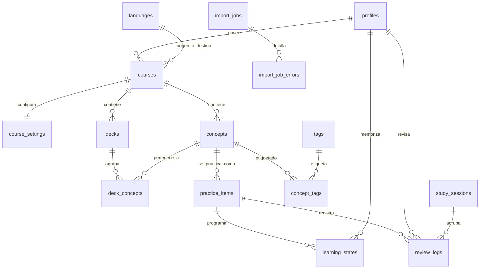

# Modelo de datos

Entidades de Lexora, cómo se relacionan y qué convenciones sigue el esquema.
Las decisiones que lo condicionan están en
[ADR-002](adrs/ADR-002-supabase-sin-orm.md) y
[ADR-003](adrs/ADR-003-fsrs-programa-practice-item.md).

> **Estado:** ninguna tabla existe todavía. Este documento describe el modelo
> acordado; las columnas exactas, restricciones e índices se fijan en las
> migraciones SQL de cada fase, que son la fuente de verdad del esquema.

## La distinción que lo explica todo

```text
Concept          «achievement» — la unidad de conocimiento
   │
   ├── PracticeItem A   achievement → logro          (reconocimiento)
   ├── PracticeItem B   logro → achievement          (recuperación)
   ├── PracticeItem C   audio → achievement          (dictado, futuro)
   └── PracticeItem D   escribe una frase con…       (producción, futuro)
                              │
                              └── LearningState      un estado por usuario e ítem
```

Un concepto agrupa; **no** acumula progreso. El estado de memoria pertenece a la
pareja *(usuario, `PracticeItem`)*, porque reconocer una palabra y ser capaz de
producirla son capacidades distintas que se olvidan a ritmos distintos.

Una variación superficial del enunciado no crea un calendario nuevo: dos frases
con hueco que miden la misma recuperación son variantes de presentación del mismo
`PracticeItem`.

## Diagrama



## Entidades

### Identidad y configuración

| Tabla | Papel |
|---|---|
| `profiles` | Extensión uno a uno de la tabla de usuarios de autenticación: nombre, idioma de interfaz, zona horaria, fin del onboarding. |
| `languages` | Catálogo de referencia. Permite representar un idioma y su variante regional sin mezclarlos con el idioma de la interfaz. |
| `courses` | Relaciona un idioma de origen con uno de destino y configura la experiencia de estudio. |
| `course_settings` | Preferencias por curso: límite diario de elementos nuevos, límite de repasos, versión de configuración del planificador. |

Cuatro conceptos de idioma se mantienen separados a propósito: idioma de la
interfaz, idioma de apoyo, idioma estudiado y variante regional del contenido.
Mezclarlos es la vía rápida a un modelo que no admite un segundo par de idiomas.

### Biblioteca

| Tabla | Papel |
|---|---|
| `decks` | Agrupación organizativa por nivel, tema o finalidad. No posee el progreso: solo selecciona qué estudiar. |
| `concepts` | La unidad de conocimiento: palabra, expresión, regla, función comunicativa o contraste de pronunciación. |
| `deck_concepts` | Relación muchos a muchos. Permite que un concepto esté en varios mazos **sin duplicar su progreso**. |
| `practice_items` | Una competencia programable sobre un concepto, con su modo y su contenido. |
| `tags`, `concept_tags` | Etiquetas del usuario, con soporte para las jerarquías que llegan en la importación. |

`concepts` guarda una clave normalizada que sirve para **sugerir** duplicados.
No se usa para fusionarlos automáticamente: dos entradas idénticas pueden tener
matices distintos, y una fusión destructiva no se puede deshacer.

### Estudio

| Tabla | Papel |
|---|---|
| `learning_states` | Una fila por usuario e ítem de práctica: vencimiento, estabilidad, dificultad, repeticiones, lapsos, estado y última revisión. Incluye un contador de versión para control de concurrencia. |
| `study_sessions` | Agrupa repasos para poder resumirlos. No persiste la cola completa. |
| `review_logs` | Registro **append-only** de cada repaso: valoración, momento, y una instantánea del estado antes y después. |

`review_logs` es la pieza que permite auditar, reconstruir estados y migrar entre
versiones del algoritmo. El usuario no edita estas filas.

*Matiz importante:* «append-only» describe el funcionamiento normal, no impide
cumplir una solicitud de eliminación de cuenta. Borrar los datos propios sigue
siendo un derecho del usuario.

### Importación

| Tabla | Papel |
|---|---|
| `import_jobs` | Un trabajo de importación: destino, mapeo de columnas, estado y contadores. |
| `import_job_errors` | Errores por fila, con mensaje seguro y una muestra acotada y saneada. |

El archivo completo no se conserva indefinidamente.

### Tablas futuras

`media_assets`, `exercise_variants`, `user_responses`, `ai_feedback` y
`error_events` se crearán cuando se implementen las versiones que las necesiten.
No se crean tablas vacías por anticipación.

## Convenciones

| Convención | Regla |
|---|---|
| Identificadores | UUID. |
| Fechas y horas | Siempre en UTC. La conversión a día local usa la zona horaria del perfil, nunca la del navegador. |
| Restricciones | `NOT NULL`, `CHECK`, claves foráneas e índices explícitos y justificados. |
| Borrado | Archivado o borrado controlado para todo lo que tenga historial. Cascada solo cuando es segura y deliberada. |
| Estados cerrados | Enumeraciones de PostgreSQL o restricciones equivalentes. |
| JSON | Solo para configuraciones discriminadas, instantáneas históricas y extensiones. Nunca como sustituto de una columna que se consulta. |
| Seguridad | RLS habilitado en toda tabla expuesta, con políticas explícitas por propietario. |
| Índices | Sobre propietarios, claves foráneas, fecha de vencimiento, estados y filtros habituales. |

## Cuándo aparece cada tabla

| Fase | Tablas |
|---|---|
| 2 | `profiles`, `languages`, `courses`, `course_settings` |
| 3 | `decks`, `concepts`, `deck_concepts`, `practice_items`, `tags`, `concept_tags` |
| 4 | `import_jobs`, `import_job_errors` |
| 5 | `learning_states`, `study_sessions`, `review_logs` |

## Pendiente

- Columnas exactas, tipos y restricciones de cada tabla: se fijan en su migración.
- Política de índices, una vez existan consultas reales que medir.
- Estrategia de retención de registros históricos y de anonimización al eliminar una cuenta.
- Diagrama regenerado desde el esquema real cuando existan migraciones.
